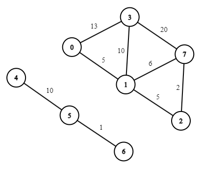
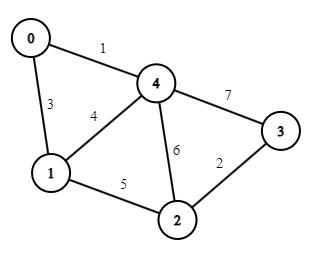

## Формат входных данных:

Вам необходимо реализовать функцию <code>solution(data: str) -> (int, int)</code> в файле <code>ethernet.py</code>, которая принимает на вход тестовые данные в виде multi-line строки.

В первой строке входных данных записаны два значения: **N** и **M**, вершин графа и ребер соответственно. Вершины занумерованы, начиная с 0.

В последующих **M** строках описаны линии передач в виде:

**from** **to** **weight**  – одна вершина; другая; соединующее их ребро.

## Формат выходных данных:

В качестве ответа из функции <code>solution</code> необходимо вернуть пару: количество компонент связности минимального по весу остовного дерева, суммарный вес всех его ребер.

|   input  |     output    |  графы |
|----------|:-------------:|:-------:|
| 8 9 0 3 13 0 1 5 3 1 10 1 2 5 4 5 10 5 6 1 1 7 6 2 7 2 3 7 20 | 2 33 | | 
||||
|5 7   0 1 3 0 4 1 1 4 4 1 2 5 2 3 2 3 4 7 2 4 6|1 11|| 

